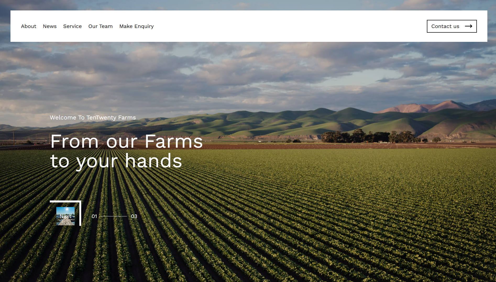

# TenTwenty Frontend Developer Assessment

## Overview
This repository contains the solution for the **TenTwenty Frontend Developer assessment**. The goal is to demonstrate proficiency in **React.js, JavaScript, TailwindCSS, HTML, and CSS**, implementing the design provided in the Figma file.

---

## Live Preview
- **Deployed :** [ten20.afzaldev.in](https://ten20.afzaldev.in)
---

## Technologies Used
- **Next.js** (Functional Components + Hooks)  
- **TailwindCSS** (Utility-first styling)  
- **Typescript**
- **GSAP**  (Custom Cursor)
- **HTML5 & CSS3**  
- **Responsive Design** (Mobile-first approach)  

---

## Guidelines Followed
- Modular, reusable, and easy-to-understand components.  
- Clean and readable code with proper naming conventions.  
- Pixel-perfect implementation following the Figma design.  
- Smooth **animations** using CSS keyframes and transitions.  
- TailwindCSS utilized wherever possible to minimize repetitive code.  
- Basic SEO considerations (alt tags, semantic HTML).  

---

## Contact
- **Email:** hello@afzaldev.in  
- **Portfolio:** [afzaldev.in](https://afzaldev.in)
